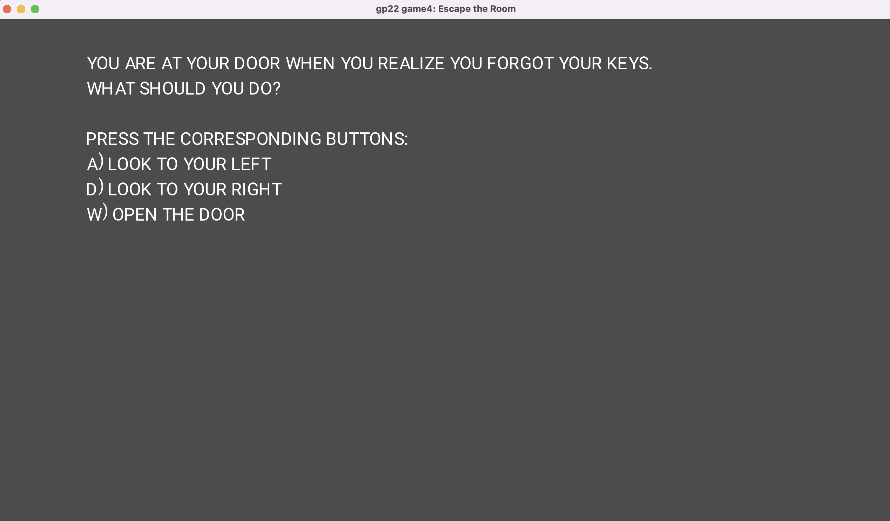

# Escape the Room

Author: David Zelong Fan

Design: An escape room game that imitates natural movement and allows the player to smash items in the room.

Text Drawing: Text is rendered at runtime. A .ttf file is used to generate a FreeType face, used to generate a harfbuzz font. We then use harfbuzz codrpoints to generate glyphs in FreeType, and position the glyphs using harfbuzz position values. (The position doesn't really work and I ran out of time, so I forced everything into upper case).

Choices: The game stores all the states in a single finite state machine. I really wanted to try this, but (as expected) this is not a good structure. Every new item would almost double the number of states.

Screen Shot:

How To Play:
Press WASD to make choices and progress through the game.

Sources: 
https://fonts.google.com/specimen/Roboto
https://github.com/harfbuzz/harfbuzz-tutorial/blob/master/hello-harfbuzz-freetype.c
https://learnopengl.com/In-Practice/Text-Rendering
https://learnopengl.com/Getting-started/Shaders
https://stackoverflow.com/questions/735204/convert-a-string-in-c-to-upper-case
https://stackoverflow.com/questions/14265581/parse-split-a-string-in-c-using-string-delimiter-standard-c

This game was built with [NEST](NEST.md).

